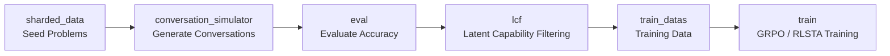
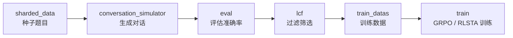

# RLSTA — Reinforcement Learning with Single-Turn Anchors

A generalizable training framework designed to break *Contextual Inertia* in multi-turn LLM interactions. RLSTA leverages the model's superior single-turn capabilities as internal reward signals, applicable to diverse interaction scenarios including both incremental information addition (**MT-Add**) and error correction (**MT-Refine**).

The project covers the full end-to-end pipeline: **Data Generation → Evaluation → Latent Capability Filtering → Training**.

---

## Project Structure

```
RLSTA/
├── sharded_data/              # Seed data (math problems)
├── conversation_simulator/    # Step 1: Single-turn / multi-turn conversation generator
├── eval/                      # Step 2: Response evaluation (accuracy scoring)
├── lcf/                       # Step 3: Latent Capability Filtering — data filtering
├── train_datas/               # Step 3 output: filtered training data
├── train/                     # Step 4: GRPO / RLSTA reinforcement learning training
├── utils/                     # Shared utilities (API calls, eval functions, prompt templates)
├── acc_rawdata/               # Evaluation intermediates (raw accuracy data)
└── eval_responses/            # Model inference response cache
```

---

## Pipeline Overview



| Stage | Module | Description |
|-------|--------|-------------|
| **1. Generation** | `conversation_simulator/` | Supports singleturn, mt_add, mt_refine modes; calls LLM API to generate conversations |
| **2. Evaluation** | `eval/` | Scores generated responses for accuracy on math tasks |
| **3. Filtering** | `lcf/` | **Latent Capability Filtering**: isolates instances where the model possesses the latent capability to solve a problem in single-turn (given merged full information), yet fails under the original multi-turn history — retaining cases where E[Ver(m\|i_full)] > E[Ver(m_n\|H)], thereby using the model's single-turn ability as a stable anchor |
| **4. Training** | `train/` | Supports standard GRPO and RLSTA (GRPO + reference-model likelihood reward) training modes |

---

## Quick Start

```bash
# 1. Generate conversation data
bash conversation_simulator/run.sh mt_add \
    --trails 1,2,3,4 \
    --base-url "$BASE_URL" --openai-api-key "$API_KEY" \
    --model-name hunyuan-2.0-instruct-20251111 \
    --datatype math_train

# 2. Evaluate
bash lcf/run.sh singleturn_eval --input-dir eval_responses/... --output-tag ...
bash lcf/run.sh multiturn_eval --input-dir eval_responses/... --output-tag ...

# 3. Filter
bash lcf/run.sh filter \
    --singleturn-eval st_acc_math_train.json \
    --multiturn-eval mt_acc_math_train.json \
    --output-tag hunyuan-2.0-instruct-20251111 \
    --datatype math_train \
    --filter-item-numbers 2,4 \
    --output-prefix lcf_math \
    --sample-per-task 2

# 4. Train
bash train/run_grpo.sh lcf_math_200 hunyuan-2.0-instruct-20251111 48 0,1,2,3,4,5,6,7
```

---

## Module Documentation

- [`conversation_simulator/`](conversation_simulator/) — Conversation generator
- [`eval/`](eval/README.md) — Evaluation module
- [`lcf/`](lcf/README.md) — Latent Capability Filtering module
- [`train/`](train/README.md) — Training module


RLSTA/
├── sharded_data/              # 原始种子数据（math / code / database 等）
├── conversation_simulator/    # Step 1: 多轮 / 单轮对话生成器
├── eval/                      # Step 2: 模型响应评估（accuracy 评分）
├── lcf/                       # Step 3: Lost-in-Conversation Filter — 数据过滤与筛选
├── train_datas/               # Step 3 输出: 过滤后的训练数据
├── train/                     # Step 4: GRPO / RLSTA 强化学习训练
├── utils/                     # 公共工具库（API 调用、评测函数、Prompt 模板等）
├── acc_rawdata/               # 评估中间产物（accuracy 原始数据）
└── eval_responses/            # 模型推理响应缓存
```

---

## 流程概览



| 阶段 | 模块 | 说明 |
|------|------|------|
| **1. 对话生成** | `conversation_simulator/` | 支持 singleturn、mt_add、mt_refine 等多种模式，调用 LLM API 生成对话 |
| **2. 评估** | `eval/` | 对生成的响应进行 accuracy 评分，支持 math 等多种任务类型 |
| **3. 过滤** | `lcf/` | 基于单轮/多轮评估结果进行交叉过滤，筛选高质量训练样本 |
| **4. 训练** | `train/` | 支持标准 GRPO 和 RLSTA（GRPO + 参考模型似然度奖励）两种训练模式 |

---

## 快速开始

```bash
# 1. 生成对话数据
bash conversation_simulator/run.sh mt_add \
    --trails 1,2,3,4 \
    --base-url "$BASE_URL" --openai-api-key "$API_KEY" \
    --model-name hunyuan-2.0-instruct-20251111 \
    --datatype math_train

# 2. 评估
bash lcf/run.sh singleturn_eval --input-dir eval_responses/... --output-tag ...
bash lcf/run.sh multiturn_eval --input-dir eval_responses/... --output-tag ...

# 3. 过滤
bash lcf/run.sh filter \
    --singleturn-eval st_acc_math_train.json \
    --multiturn-eval mt_acc_math_train.json \
    --output-tag hunyuan-2.0-instruct-20251111 \
    --datatype math_train \
    --filter-item-numbers 2,4 \
    --output-prefix lcf_math \
    --sample-per-task 2

# 4. 训练
bash train/run_grpo.sh lcf_math_200 hunyuan-2.0-instruct-20251111 48 0,1,2,3,4,5,6,7
```

---

## 各模块文档

- [`conversation_simulator/`](conversation_simulator/) — 对话生成器
- [`eval/`](eval/README.md) — 评估模块
- [`lcf/`](lcf/README.md) — 数据过滤模块
- [`train/`](train/README.md) — 训练模块
