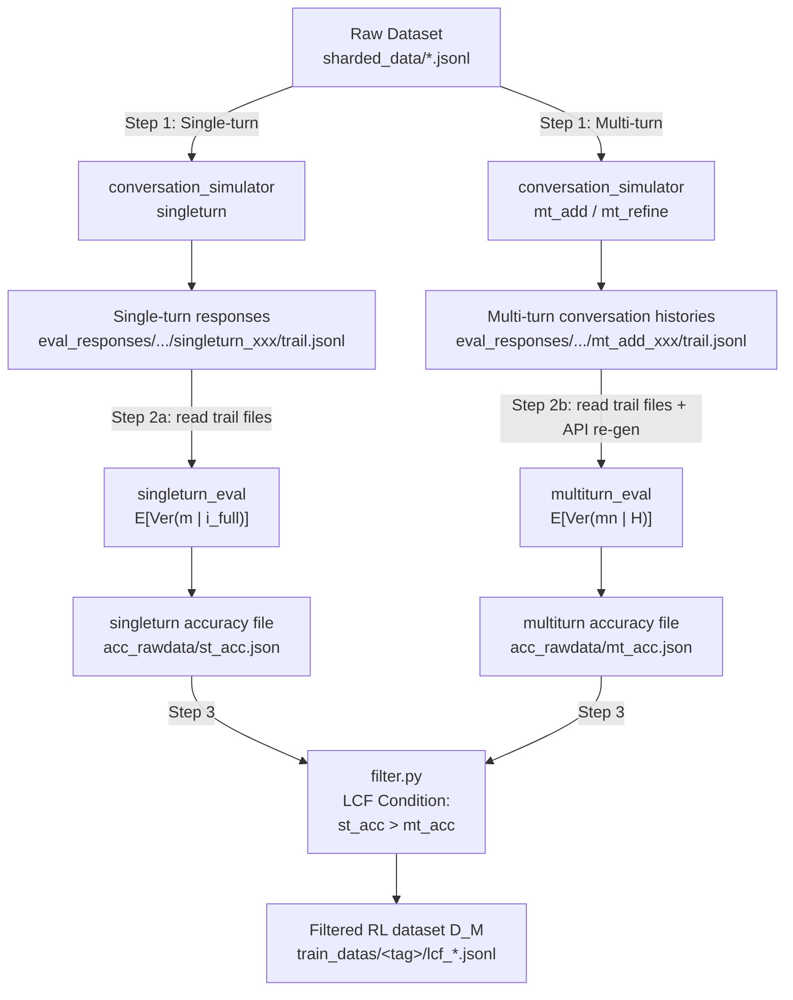

# Latent Capability Filtering (LCF)

## Overview

LCF is a data-filtering pipeline that selects multi-turn conversation histories for RL training. The core idea is to **retain only those conversation histories where the model possesses the latent capability to solve the problem given full information, yet fails under the original multi-turn history**. This ensures we can use the model's single-turn ability as a stable anchor for alignment.

The LCF condition (Eq. 2):

```
E_{m ~ π(·|i_full)}[Ver(m)]  >  E_{mn ~ π(·|H)}[Ver(mn)]
```

Where:
- `i_full = merge(i_0, ..., i_n)` is the full information merged into a single prompt
- `H` is the multi-turn conversation history
- `Ver(·)` is a verifier that checks correctness with 0/1
- `π` is the model policy

The pipeline has **three stages**:

1. **Collect conversation histories** `D_raw` — using `conversation_simulator` (mt_add / mt_refine for multi-turn, singleturn for single-turn)
2. **Compute two accuracy scores** for each task:
   - **Single-turn accuracy** `E[Ver(m | i_full)]` — using `lcf/singleturn_eval.py`
   - **Multi-turn accuracy** `E[Ver(mn | H)]` — using `lcf/multiturn_eval.py`
3. **Apply LCF filtering** — using `lcf/filter.py` to retain histories satisfying the condition and build the RL training dataset `D_M`



---

## Step 1: Collect Multi-Turn/Single-Turn Conversation Histories

Use `conversation_simulator` to generate conversation histories. The first positional argument selects the simulation method:

**Multi-turn modes** (produce multi-turn conversation histories `H`):

- **`mt_add`** — Splits the problem information into shards and sends them one per turn. The model only sees partial information at each turn.
- **`mt_refine`** — First provides modified (incorrect) information in the first turn, then corrects it shard by shard in subsequent turns.

**Single-turn mode** (produces single-turn baseline responses):

- **`singleturn`** — Concatenates all information shards into a single prompt (`i_full = merge(i_0, ..., i_n)`) and generates a response in one turn. This serves as the single-turn baseline for measuring the model's latent capability.

```bash
cd /path/to/RLSTA

# ---- Multi-turn: mt_add mode ----

bash conversation_simulator/run.sh mt_add \
    --trails 1,2,3,4 \
    --base-url "$BASE_URL"
    --openai-api-key "$API_KEY"
    --datatype math_train \
    --model-name hunyuan-2.0-instruct-20251111 \
    --limit 20 &

# ---- Multi-turn: mt_refine mode ----
bash conversation_simulator/run.sh mt_refine \
    --trails 1,2,3,4 \
    --base-url "$BASE_URL" \
    --openai-api-key "$API_KEY" \
    --datatype math_train \
    --model-name hunyuan-2.0-instruct-20251111 \
    --limit 20 &

# ---- Single-turn: singleturn mode ----
bash conversation_simulator/run.sh singleturn \
    --trails 1,2,3,4 \
    --base-url "$BASE_URL" \
    --openai-api-key "$API_KEY" \
    --datatype math_train \
    --model-name hunyuan-2.0-instruct-20251111 \
    --limit 20

```

### Parameters

| Parameter | Description | Example |
|-----------|-------------|---------|
| `--trail` | Experiment trial number (used in output filename) | `1` |
| `--base-url` | Model inference server URL | `http://localhost:8000/v1` |
| `--openai-api-key` | API key for the inference server | `your_api_key` |
| `--datatype` | Data type key (auto-resolved with mode prefix, e.g. `math_train` with `mt_add` → `mt_add_math_train`) | `math_test`, `math_train` |
| `--gentype` | Generation mode: `think` (with reasoning) or `nothink` (direct) | `nothink` |
| `--model-name` | Model name (auto-detected if omitted) | `Qwen2.5-7B-Instruct` |
| `--max-workers` | Parallel thread count | `16` |
| `--limit` | Max problems to load (0 = all, useful for debugging) | `10` |
| `--strategy` | (mt_refine only) Correction strategy | `mt-refine` |

### Output

**Multi-turn** output:
```
eval_responses/<model_id>/<mode>_<task_type>/<trail>.jsonl
# e.g. eval_responses/8000/mt_add_math_train/1.jsonl
#      eval_responses/8000/mt_refine_math_train/1.jsonl
```

Format (JSONL, one record per line):
```json
{"task_id": "gsm8k/0", "full_messages": [{"role": "system", "content": "..."}, {"role": "user", "content": "..."}, {"role": "assistant", "content": "..."}, ...]}
```

**Single-turn** output:
```
eval_responses/<model_id>/singleturn_<task_type>/<trail>.jsonl
```

Format (JSONL, one record per line):
```json
{"task_id": "gsm8k/0", "full_messages": "<response_string>"}
```

---

## Step 2: Compute Accuracy Scores

Two accuracy scores are computed independently. They measure the model's performance under different conditions and will be compared in Step 3.

### 2a: Single-Turn Accuracy — `E[Ver(m | i_full)]`

**What it does:** Reads **all trail files** from the singleturn output directory (produced in Step 1), aggregates responses by task_id across all trails, and evaluates each response against the ground-truth answer to compute mean accuracy.

**Why:** This measures the model's **latent capability** — whether it *can* solve the problem when given all the information at once, without the interference of a multi-turn conversation history.

**No API call needed** — this step only reads existing responses and evaluates them.

```bash
cd /path/to/RLSTA

bash lcf/run.sh singleturn_eval \
    --input-dir eval_responses/hunyuan-2.0-instruct-20251111/singleturn_math_train \
    --datatype math_train \
    --output-file-name st_acc_math_train.json
```

| Parameter | Description | Example |
|-----------|-------------|---------|
| `--input-dir` | Directory containing trail JSONL files from Step 1 singleturn mode | `eval_responses/<model>/singleturn_math_train` |
| `--datatype` | Task type for loading ground-truth answers | `math_train` |
| `--output-file-name` | Output filename (written to `acc_rawdata/`) | `st_acc_math_train.json` |

**Output format** (`acc_rawdata/<output-file-name>`):

```json
{
  "math/0": {
    "eval_result_list": [true, false, true, true],
    "final_acc_list": [0.75],
    "final_answer_list": ["response_trail1", "response_trail2", "response_trail3", "response_trail4"]
  },
  ...
}
```

- `final_acc_list[0]` is the **mean accuracy** over all trail responses for this task, i.e., `E[Ver(m | i_full)]`
- `eval_result_list` contains per-trail correctness (true/false)
- `final_answer_list` contains the raw response text from each trail

### 2b: Multi-Turn Accuracy — `E[Ver(mn | H)]`

**What it does:** Reads **all trail files** from the multiturn output directory, aggregates conversation histories by task_id. For each conversation history, strips the last assistant turn and re-generates `N` candidate responses (precontext approach). Each candidate is verified against the ground-truth answer.

**Why:** This measures the model's performance **under the influence of the multi-turn conversation history**. If the preceding context is low-quality or misleading, the model may fail even though it has the latent capability.

**API call needed** — this step re-generates the last turn via the model API.

```bash
cd /path/to/RLSTA

bash lcf/run.sh multiturn_eval \
    --input-dir eval_responses/hunyuan-2.0-instruct-20251111/mt_add_math_train \
    --base-url "$BASE_URL" \
    --openai-api-key "$API_KEY" \
    --model-name hunyuan-2.0-instruct-20251111 \
    --datatype math_train \
    --responses-num 4 \
    --output-file-name mt_add_math_train.json
```

| Parameter | Description | Example |
|-----------|-------------|---------|
| `--input-dir` | Directory containing trail JSONL files from Step 1 multiturn mode | `eval_responses/<model>/mt_add_math_train` |
| `--base-url` | Model inference server URL | `http://localhost:8000/v1` |
| `--openai-api-key` | API key for the inference server | `your_api_key` |
| `--model-name` | Model name (auto-detected if omitted) | `hunyuan-2.0-instruct-20251111` |
| `--datatype` | Task type for loading ground-truth answers | `math_train` |
| `--responses-num` | Number of candidate responses per conversation history (default: 4) | `4` |
| `--max-workers` | Parallel thread count | `16` |
| `--max-tokens` | Max generation tokens | `1024` |
| `--output-file-name` | Output filename (written to `acc_rawdata/`) | `mt_acc_math_train.json` |

**Output format** (`acc_rawdata/<model_name>/<output-file-name>`):

The output is a **JSON list** (not a dict). Each element corresponds to one conversation history — `task_id` may repeat across entries (one entry per conversation history, not per task).

```json
[
  {
    "task_id": "gsm8k/0",
    "messages": [{"role": "system", "content": "..."}, {"role": "user", "content": "..."}, {"role": "assistant", "content": "..."}, ...],
    "eval_result_list": [true, false, false, true],
    "acc": 0.5,
    "final_answer_list": ["resp1", "resp2", "resp3", "resp4"]
  },
  {
    "task_id": "gsm8k/0",
    "messages": [{"role": "system", "content": "..."}, {"role": "user", "content": "..."}, {"role": "assistant", "content": "..."}, ...],
    "eval_result_list": [false, false, true, false],
    "acc": 0.25,
    "final_answer_list": ["resp1", "resp2", "resp3", "resp4"]
  },
  ...
]
```

- Each entry is one conversation history from the trail files; `task_id` can repeat (e.g. same task from different trails)
- `messages` is the original `full_messages` from the trail file (the complete multi-turn conversation history)
- `acc` is the proportion of correct candidates out of `N`, i.e., `E[Ver(mn | H)]` for that specific history
- `eval_result_list` contains per-candidate correctness (true/false), length = `--responses-num`
- `final_answer_list` contains the raw re-generated response text for each candidate
- Entries with null `full_messages` are automatically skipped and not included in the output

---

## Step 3: LCF Filtering and RL Dataset Construction

Given the single-turn and multi-turn accuracy files from Step 2, `filter.py` applies the LCF condition and produces the final RL training dataset.

### Filtering Logic

For each task_id and each conversation history:

1. **Load** `singleturn_acc = E[Ver(m | i_full)]` from the single-turn accuracy file (one scalar per task)
2. **Load** `multiturn_acc = E[Ver(mn | H)]` from the multi-turn accuracy file (one value per conversation history)
3. **Retain** histories where `multiturn_acc < singleturn_acc`

This excludes two categories:
- Histories where the model **also fails in single-turn** (no latent capability → no useful signal)
- Histories where **multi-turn and single-turn performances are comparable** (the conversation history doesn't degrade performance → no contextual inertia to break)

The retained set focuses on instances where the model has **superior single-turn capability**, providing a high-quality supervision signal for RL alignment.

### Usage

```bash
cd /path/to/RLSTA

bash lcf/run.sh filter \
    --singleturn-eval st_acc_math_train.json \
    --multiturn-eval mt_add_math_train.json \
    --output-tag hunyuan-2.0-instruct-20251111 \
    --datatype math_train \
    --filter-item-numbers 2,4 \
    --output-prefix lcf_math \
    --sample-per-task 2
```

| Parameter | Description | Example |
|-----------|-------------|---------|
| `--singleturn-eval` | Filename (or `<model_name>/<filename>`) under `acc_rawdata/` for single-turn accuracy. If the file is not found directly, the tool auto-prepends the model name inferred from `--output-tag`. | `st_acc_math_train.json` or `hunyuan-2.0-instruct-20251111/st_acc_math_train.json` |
| `--multiturn-eval` | Filename (or `<model_name>/<filename>`) under `acc_rawdata/` for multi-turn accuracy. Same auto-resolution logic as above. | `mt_acc_math_train.json` or `hunyuan-2.0-instruct-20251111/mt_acc_math_train.json` |
| `--output-tag` | Model tag, used as subdirectory under `train_datas/` | `hunyuan-2.0-instruct-20251111` |
| `--datatype` | Task type for loading ground-truth answers (auto-resolved via `task_config`). Available: `math_train`, `math_test`, `code_test`, `summary`, `database`, `actions` | `math_train` |
| `--output-prefix` | Prefix for output JSONL filenames | `lcf_math` |
| `--filter-item-numbers` | Comma-separated list of dataset sizes to produce | `200,400` |
| `--sample-per-task` | Max conversation histories to sample per task_id | `2` |
| `--add-single` | (Flag) Also add a single-turn anchor entry per task_id | — |

### Output

```
train_datas/<output-tag>/lcf_math_200.jsonl
train_datas/<output-tag>/lcf_math_400.jsonl
```

Each line is an RL training instance:
```json
{
  "task_id": "math/42",
  "completion": [{"role": "system", "content": "..."}, {"role": "user", "content": "..."}, {"role": "assistant", "content": "..."}, {"role": "user", "content": "..."}],
  "answer": "42"
}
```

- `completion` is the conversation history **with the last assistant turn removed** (the model will generate it during RL)
- `answer` is the ground-truth answer for reward computation

---

## End-to-End Example

A complete example using `math_train` dataset with `hunyuan-2.0-instruct-20251111`:

```bash
# ============================================================
# 0. Prerequisites
# ============================================================
cd /path/to/RLSTA

# ============================================================
# 1a. Generate multi-turn conversation histories
# ============================================================
bash conversation_simulator/run.sh mt_add \
    --trails 1,2,3,4 \
    --base-url "$BASE_URL" \
    --openai-api-key "$API_KEY" \
    --datatype math_train \
    --model-name hunyuan-2.0-instruct-20251111

# Output: eval_responses/hunyuan-2.0-instruct-20251111/mt_add_math_train/{1,2,3,4}.jsonl

# ============================================================
# 1b. Generate single-turn responses (for latent capability)
# ============================================================
bash conversation_simulator/run.sh singleturn \
    --trails 1,2,3,4 \
    --base-url "$BASE_URL" \
    --openai-api-key "$API_KEY" \
    --datatype math_train \
    --model-name hunyuan-2.0-instruct-20251111 \
    --gentype nothink

# Output: eval_responses/hunyuan-2.0-instruct-20251111/singleturn_math_train/{1,2,3,4}.jsonl

# ============================================================
# 2a. Compute single-turn accuracy: E[Ver(m | i_full)]
#     (No API call — reads existing trail files)
# ============================================================
bash lcf/run.sh singleturn_eval \
    --input-dir eval_responses/hunyuan-2.0-instruct-20251111/singleturn_math_train \
    --datatype math_train \
    --output-file-name st_acc_math_train.json

# Output: acc_rawdata/st_acc_math_train.json

# ============================================================
# 2b. Compute multi-turn accuracy: E[Ver(mn | H)]
#     (Needs API — re-generates last turn with 4 candidates)
# ============================================================
bash lcf/run.sh multiturn_eval \
    --input-dir eval_responses/hunyuan-2.0-instruct-20251111/mt_add_math_train \
    --base-url "$BASE_URL" \
    --openai-api-key "$API_KEY" \
    --model-name hunyuan-2.0-instruct-20251111 \
    --datatype math_train \
    --responses-num 4 \
    --output-file-name mt_acc_math_train.json

# Output: acc_rawdata/mt_acc_math_train.json

# ============================================================
# 3. Apply LCF filtering and build RL dataset
# ============================================================
bash lcf/run.sh filter \
    --singleturn-eval st_acc_math_train.json \
    --multiturn-eval mt_acc_math_train.json \
    --output-tag hunyuan-2.0-instruct-20251111 \
    --datatype math_train \
    --filter-item-numbers 200,400 \
    --output-prefix lcf_math \
    --sample-per-task 2

# Output:
#   train_datas/hunyuan-2.0-instruct-20251111/lcf_math_200.jsonl
#   train_datas/hunyuan-2.0-instruct-20251111/lcf_math_400.jsonl
```

---

## Directory Structure

```
RLSTA/
├── conversation_simulator/          # Conversation simulation
│   ├── base.py                      # SimulationBase — shared base class
│   ├── mt_add.py                    # mt_add: add one shard per turn
│   ├── mt_refine.py                 # mt_refine: introduce errors then correct
│   ├── precontext.py                # precontext: re-generate last turn candidates
│   ├── singleturn.py                # Single-turn baseline
│   ├── self_correct.py              # Self-correction simulation
│   ├── llm_simulator.py             # LLM-as-user simulation
│   ├── task_config.py               # Task data configuration
│   └── run.sh                       # Unified entry script
├── lcf/                             # Latent Capability Filtering
│   ├── singleturn_eval.py           # Compute E[Ver(m | i_full)] from trail files
│   ├── multiturn_eval.py            # Compute E[Ver(mn | H)] via precontext re-gen
│   ├── filter.py                    # Apply LCF condition + build RL dataset
│   ├── run.sh                       # Unified entry script
│   └── README.md                    # This file
├── eval_responses/                  # Step 1 output: conversation histories
│   └── <model_id>/
│       ├── mt_add_<task>/
│       │   └── <trail>.jsonl
│       ├── mt_refine_<task>/
│       │   └── <trail>.jsonl
│       └── singleturn_<task>/
│           └── <trail>.jsonl
├── acc_rawdata/                     # Step 2 output: accuracy files
│   ├── <singleturn_acc>.json
│   └── <multiturn_acc>.json
└── train_datas/                     # Step 3 output: RL training datasets
    └── <output-tag>/
        └── lcf_<prefix>_<N>.jsonl
```
