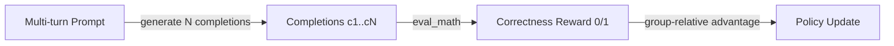
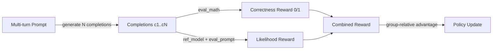
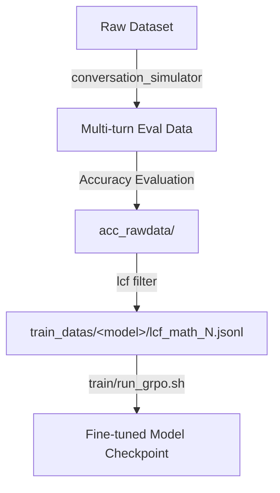

# RLSTA Train — GRPO / RLSTA Training Module

This module provides **reinforcement learning fine-tuning** for language models
using two training modes:

| Mode | Trainer | Description |
|------|---------|-------------|
| `base` | `GRPOTrainer` (TRL) | Standard Group Relative Policy Optimization |
| `rlsta` | `RLSTATrainer` | GRPO + self-verification via reference-model likelihood |

---

## Directory Structure

```
train/
├── README.md                    # This file
├── run_grpo.sh                  # Launch script (DeepSpeed + Accelerate)
├── train_grpo.py                # Training entry point (data loading, reward, main loop)
├── rlsta_trainer.py             # RLSTATrainer class (extends GRPOTrainer)
└── accelerate_ds_zero3.yaml     # Accelerate + DeepSpeed ZeRO-3 config
```

---

## Training Mechanisms

### 1. Standard GRPO (`--train_mode base`)



Standard GRPO workflow:
1. For each training sample, the model generates **N completions** from the multi-turn prompt.
2. Each completion is scored by `eval_math()` — comparing the extracted answer against ground truth (`0.0` or `1.0`).
3. Group-relative advantages are computed (within-group normalization).
4. The policy is updated to maximize advantage-weighted log probabilities.

### 2. RLSTA (`--train_mode rlsta`)



RLSTA extends GRPO by adding a **self-verification reward signal**:

1. A **single-turn eval prompt** is constructed by merging all user turns into one message
   (removing conversation history artifacts).
2. The **reference model** computes `log P_ref(completion | eval_prompt)` — how likely
   the completion would be if the question were asked directly in a single turn.
3. The eval reward is: `exp(mean_logp_per_token) / num_generations`.
4. The final reward becomes: `eval_reward + correctness_reward`.

**Why this helps:**
- In multi-turn RL training, conversation history can degrade over time (the model's
  own prior turns may be low-quality).
- The eval prompt likelihood acts as a **regularizer**: it rewards completions that
  the reference model (trained on single-turn) would also consider natural.
- It combines a **sparse but accurate** correctness signal with a **dense, smooth**
  likelihood signal.

**Masking logic:** When at least one completion in a group is correct (reward > 0.9),
incorrect completions get their eval_reward masked to 0 — preventing the model from
being encouraged to produce wrong answers just because they have high likelihood.

---

## Quick Start

### Prerequisites

```
pip install trl transformers datasets peft deepspeed accelerate math_verify
```

### Usage

```bash
cd /path/to/RLSTA

# Standard GRPO training
bash train/run_grpo.sh <data_name> <model_name> [epochs] [gpu_ids] [train_mode]
```

**Examples:**

```bash
# Standard GRPO
bash train/run_grpo.sh lcf_math_4 hunyuan-2.0-instruct-20251111 48 0,1,2,3,4,5,6,7 base

# RLSTA (with self-verification)
bash train/run_grpo.sh lcf_math_4 hunyuan-2.0-instruct-20251111 48 0,1,2,3,4,5,6,7 rlsta
```

### Arguments (`run_grpo.sh`)

| Position | Name | Default | Description |
|----------|------|---------|-------------|
| `$1` | `data_name` | `multiturn_gsm8k_all_100` | Training data filename (without `.jsonl`), resolved at `train_datas/<model_name>/<data_name>.jsonl` |
| `$2` | `model_name` | `Qwen2.5-7B-Instruct` | Model directory name under `/root/models/` |
| `$3` | `epochs` | `48` | Number of training epochs |
| `$4` | `gpu_ids` | `0,1,2,3,4,5,6,7` | Comma-separated GPU device IDs |
| `$5` | `train_mode` | `base` | `base` (standard GRPO) or `rlsta` (self-verification) |

---

## Training Data Format

The training data is a JSONL file where each line is a JSON object with:

```json
{
    "task_id": "math_train/123",
    "completion": [
        {"role": "system", "content": "..."},
        {"role": "user", "content": "Solve: 2+2"},
        {"role": "assistant", "content": "Let me think..."},
        {"role": "user", "content": "What is the final answer?"}
    ],
    "answer": "4"
}
```

| Field | Type | Description |
|-------|------|-------------|
| `task_id` | `str` | Unique problem identifier |
| `completion` | `list[dict]` | Multi-turn conversation history (ends with `user` turn — no final assistant response) |
| `answer` | `str` | Ground-truth answer (numeric or symbolic) |

> **Note:** The `completion` field should NOT contain the final assistant response.
> GRPO generates completions from this prompt during training.

This format is directly compatible with the output of `lcf/filter.py`.

---

## Key Hyperparameters

Default values set in `run_grpo.sh`:

| Parameter | Value | Description |
|-----------|-------|-------------|
| `max_prompt_length` | 8192 | Max tokens for the prompt |
| `max_completion_length` | 1024 | Max tokens for each generated completion |
| `micro_batch_size` | 2 | Per-device train batch size |
| `gradient_accumulation_steps` | 2 | Gradient accumulation steps |
| `lr` | 3e-7 | Learning rate |
| `weight_decay` | 1e-2 | Weight decay |
| `num_generations` | 8 | Completions generated per prompt for GRPO |
| `beta` | 1e-4 | KL penalty coefficient (in `train_grpo.py`) |

---

## Distributed Training Configuration

The module uses **two levels** of DeepSpeed configuration:

1. **`accelerate_ds_zero3.yaml`** — Accelerate-level config
   - ZeRO Stage 3: full sharding of model parameters, gradients, and optimizer states
   - Mixed precision: bf16
   - Default: 4 processes (override with `--num_processes`)

2. **`ds_config.json`** (auto-generated by `run_grpo.sh`) — Runtime DeepSpeed config
   - Optimizer: AdamW with cosine warmup
   - ZeRO Stage 2 optimizer offload to CPU
   - Gradient clipping: 1.0

---

## Output

- **Checkpoints:** saved to `/root/pipeline_ckpts/<model_name>-<data_name>-<train_mode>/`
- **Logs:** saved to `train/logs/<model_name>/<data_name>_<train_mode>.log`

---

## End-to-End Pipeline



```bash
# Step 1: Generate LCF training data
cd /path/to/RLSTA
bash lcf/run.sh filter \
    --singleturn-eval st_acc_math_train.json \
    --multiturn-eval mt_acc_math_train.json \
    --output-tag hunyuan-2.0-instruct-20251111 \
    --datatype math_train \
    --filter-item-numbers 2,4 \
    --output-prefix lcf_math \
    --sample-per-task 2

# Step 2: Train with GRPO / RLSTA
bash train/run_grpo.sh lcf_math_4 hunyuan-2.0-instruct-20251111 48 0,1,2,3,4,5,6,7 rlsta
```
